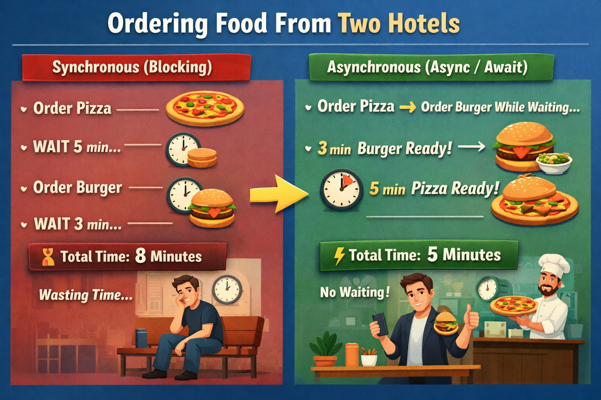

# 🌀 Python Async, Await & Asyncio

> A practical, intuitive, and code-first guide to understanding  
> **coroutines, await, asyncio tasks, and the event loop**.

---

## 🎯 Why This Repository Exists

Async programming is often explained in complicated ways.

This repository explains it the way senior engineers understand it:

- First → **Build the mental model**
- Then → **Break concepts into small pieces**
- Then → **Show minimal, focused code**
- Finally → **Compare sync vs async clearly**

If you’ve ever wondered:

- What really happens when we write `async def`?
- What exactly does `await` pause?
- Who resumes the coroutine?
- What is the event loop actually doing?

This repository answers all of that.

---

# 🍔 The Core Idea (Real-World Analogy)

## Ordering Food From Two Hotels

Imagine you order:

- 🍕 Pizza (5 minutes)
- 🍔 Burger (3 minutes)

---

### 🧍 Synchronous (Blocking)

1. Order Pizza
2. Wait 5 minutes
3. Order Burger
4. Wait 3 minutes

⏱ Total Time = **8 minutes**

You wasted time waiting.

---

### ⚡ Asynchronous (Async/Await)

1. Order Pizza
2. While waiting → Order Burger
3. Burger ready in 3 minutes
4. Pizza ready in 5 minutes

⏱ Total Time = **5 minutes**

You did not block while waiting.

<p align="center">
  
</p>

---

## 🧠 Mapping This to Python

| Real World               | Python Concept |
| ------------------------ | -------------- |
| You managing orders      | Event Loop     |
| Placing an order         | Coroutine      |
| Waiting                  | `await`        |
| Kitchen working          | Background I/O |
| Managing multiple orders | `asyncio`      |

---

# 🔄 What Actually Happens Internally

When you run async code:

1. `asyncio.run()` creates an event loop
2. The event loop starts a coroutine
3. It runs until it hits `await`
4. The coroutine pauses
5. The event loop switches to another task
6. When ready → it resumes the paused coroutine
7. This continues until all tasks finish

This is **cooperative multitasking**, not multithreading.

---

# 📂 Repository Structure

```
python-async-await-asyncio/
│
├── coroutine.py
├── await.py
├── event_loop.py
├── asyncio.py
├── sequential_vs_concurrent.py
```

Each file focuses on one clear concept with runnable examples.

---

# 🧩 Concepts Covered

---

## 1️⃣ coroutine.py

Demonstrates:

- What a coroutine is
- How `async def` works
- Why coroutines don’t run automatically
- How `asyncio.run()` starts execution

Core idea:

> A coroutine is a function that can pause and resume.

---

## 2️⃣ await.py

Demonstrates:

- What `await` does
- How a coroutine pauses
- How control returns to the event loop
- Difference between `asyncio.sleep()` and `time.sleep()`

Core idea:

> `await` suspends only the current coroutine — not the entire program.

---

## 3️⃣ event_loop.py

Demonstrates:

- How multiple coroutines run concurrently
- How the event loop switches between tasks
- Why total execution time equals the longest task (not sum)

Core idea:

> The event loop is the engine that manages and resumes coroutines.

---

## 4️⃣ asyncio.py

Demonstrates:

- `asyncio.create_task()`
- `asyncio.gather()`
- Running multiple tasks concurrently
- Difference between scheduling and awaiting

Core idea:

> Tasks allow coroutines to run in the background under event loop control.

---

## 5️⃣ sequential_vs_concurrent.py

Demonstrates:

- Blocking execution using `time.sleep()`
- Non-blocking execution using `asyncio.sleep()`
- Real timing comparison
- Why async improves I/O-bound performance

Core idea:

> Blocking waits add time.  
> Async waits overlap.

---

# ⚠️ Important Clarifications

Asyncio:

- ❌ Is NOT multithreading
- ❌ Does NOT automatically use multiple CPU cores
- ✅ Is single-threaded cooperative concurrency
- ✅ Is ideal for I/O-bound tasks
- ❌ Not suitable for CPU-heavy computations

---

# 🏗 When Should You Use Async?

Good for:

- API calls
- Web scraping
- Database queries
- File I/O
- Network servers
- Real-time systems

Not good for:

- Heavy mathematical computation
- CPU-bound loops

---

# 🚀 How to Run the Examples

Each file is independently runnable:

```bash
python coroutine.py
python await.py
python event_loop.py
python asyncio.py
python sequential_vs_concurrent.py
```

Python version recommended:

```bash
Python 3.8+
```

---

# 🧠 Final Mental Model

> A coroutine runs until it hits `await`,  
> pauses itself,  
> the event loop runs something else,  
> and later resumes it when ready.

That’s the entire async system.

Simple. Controlled. Efficient.

---

⭐ If this repository helped you, consider starring it.
